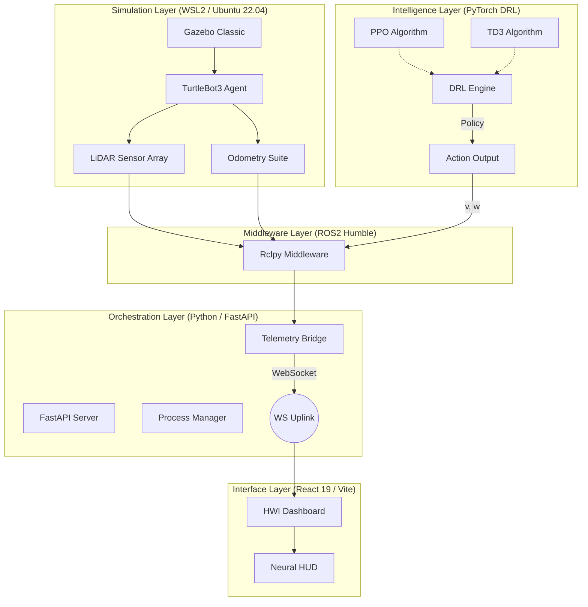

# Neural Pathfinder: Autonomous Robotics Navigation System

Neural Pathfinder is an advanced, production-grade autonomous robotics navigation platform developed to evaluate and deploy Deep Reinforcement Learning (DRL) agents in complex, simulated environments. The system integrates a robust ROS2-based simulation backplane with a high-fidelity React-based dashboard, orchestrated by a centralized FastAPI engine.

## System Architecture

The following diagram illustrates the multi-layered orchestration of the Neural Pathfinder ecosystem:



## Technical Specifications

### 1. Intelligence Layer
The system supports two primary reinforcement learning paradigms, allowing for a comparative analysis of agent behavior in diverse scenarios.

| Specification | PPO Implementation | TD3 Implementation |
| :--- | :--- | :--- |
| **Algorithm Class** | Stochastic / On-Policy | Deterministic / Off-Policy |
| **State Space** | 24-point LiDAR Scan | 24-point LiDAR Scan |
| **Action Space** | Continuous (v, w) | Continuous (v, w) |
| **Loss Function** | Clipped Surrogate Objective | Clipped Double Q-Learning |
| **Exploration** | Gaussian Noise | Target Policy Smoothing |

### 2. State and Action Definitions
- **Observation Space**: A vector of 24 float values representing normalized LiDAR ranges (0.0 to 3.5 meters).
- **Action Space**:
    - **Linear Velocity ($v$)**: 0.0 to 0.22 m/s.
    - **Angular Velocity ($\omega$)**: -1.0 to 1.0 rad/s.
- **Reward Function**: $R = d_{target} - d_{collision} + v \cdot \cos(\theta)$, where $d$ represents distance metrics and $\theta$ is the heading error.

## Operational Workflow

The platform utilizes a unified "One-Click Ignition" sequence to synchronize the distributed components.

1. **Environment Initialization**: The system sources the ROS2 Humble environment within the WSL2 container and exports required TurtleBot3 model paths.
2. **Simulation Dispatch**: Gazebo is launched in a headless or windowed mode (WSLg supported), and the robot is spawned at the mission origin.
3. **Engine Synchronization**: The selected DRL agent (PPO or TD3) connects to the ROS2 graph via the `TrainNode` to begin the control-reward loop.
4. **Telemetry Uplink**: The FastAPI server establishes high-frequency WebSocket connections to stream telemetry data (LiDAR Topology and Neural Activations).
5. **Dashboard Rendering**: The React HWI provides a real-time visualization of the Forward Pass, showing the inference flow from input to action.

## Installation and Deployment

### 1. Prerequisites
- **Operating System**: Windows 10/11 with WSL2 (Ubuntu 22.04 LTS).
- **Robotics Middleware**: ROS2 Humble Desktop.
- **Python Environment**: Python 3.10 with `torch`, `fastapi`, and `rclpy`.
- **Node Environment**: Node.js 18.0 or higher.

### 2. Execution
Run the unified launch script from the project root:
```bash
./launch_system.sh ppo  # Warehouse Logistics Mode
./launch_system.sh td3  # Tactical Defense Mode
```

## Project Documentation and Research

The Neural Pathfinder project integrates research and deployment artifacts from the following modules:

- **Warehouse Simulation**: [Pavan-Hosatti/Warehouse-simulation](https://github.com/Pavan-Hosatti/Warehouse-simulation)
- **Logistics Demo**: [pavaninsights/warehouse-demo](https://hub.docker.com/r/pavaninsights/warehouse-demo)
- **Tactical Defense**: [Abhay-aps001/drl_nav_project-Abhay](https://github.com/Abhay-aps001/drl_nav_project-Abhay)
- **Defense Robot Container**: [abhaydocx001/drl_nav_robot](https://hub.docker.com/r/abhaydocx001/drl_nav_robot)
- **Traffic Optimization**: [pavaninsights/traffic-drl](https://hub.docker.com/r/pavaninsights/traffic-drl)

## Core Development Team

- **Pavan Hosatti**: Logistics & Traffic DRL Systems.
- **Abhay**: Tactical Defense & TD3 Infrastructure.
- **Rishita**: Environment Synthesis & Simulation Modeling.
- **Sreejith Nair**: Control Systems & HWI Architecture.

## License

This project is licensed under the MIT License by the DSAI Society, IIIT Dharwad.
